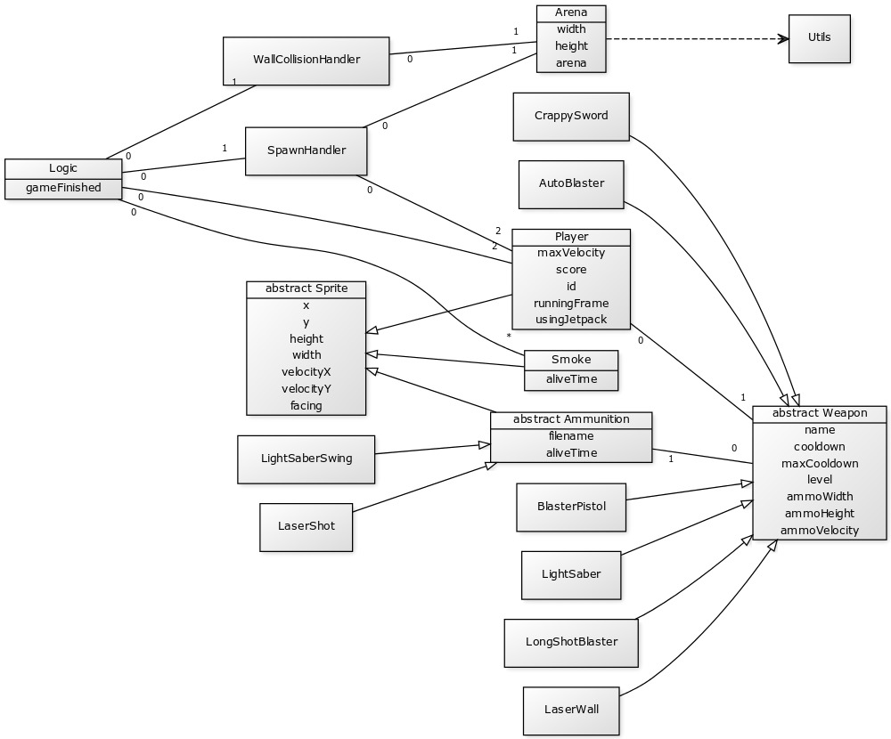
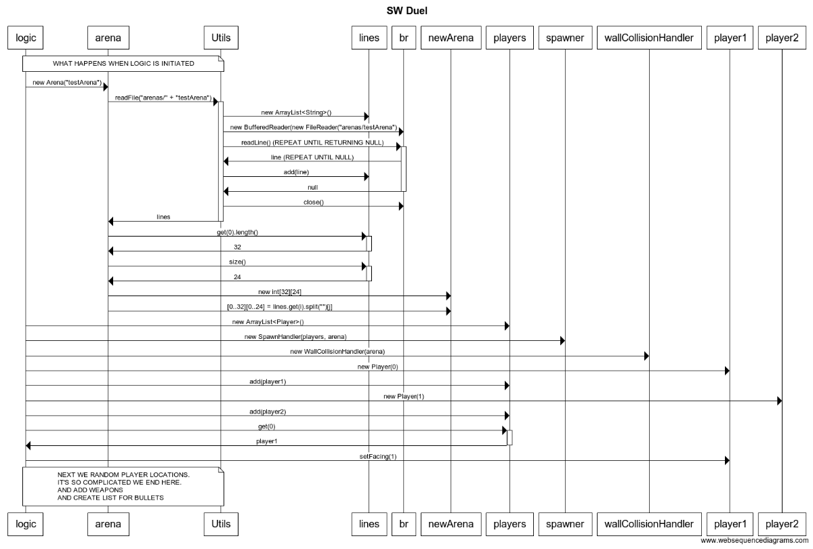

# Arkkitehtuurikuvaus

## Rakenne

Koodin rakenne on seuraava:
SwduelUi -> TitleMenu
TitleMenu -> Game
Game -> Logic / GameScreen / ActionHandler
Logic -> Kaikki loput

## Käyttöliittymä

Käyttöliittymä sisältää kaksi erillistä näkymää

- valikkonäkymä
- pelinäkymä

molemmat ovat toteutettu omana Scene-oliona. Näkymistä yksi kerrallaan on näkyvänä, eli sijoitettu sovelluksen stageen. Käyttöliittymä on pakkauksessa swduel.ui.

## Sovelluslogiikka

Löytyy pakkauksesta swduel.domain

Valikkonäkymän logiikasta huolehtii luokka TitleMenu (osa UI:ta).

Pelinäkymän sovelluslogiikasta huolehtii luokka Game, jolle annetaan parametrina pelattavan areenan nimi.

Luokka Game huolehtii peliin syötettävistä parametreistä.
- Luokka Logic, joka huolehtii pelin logiikasta.
- Luokka GameScreen, joka huolehtii kaiken piirtämisestä.
- Luokka ActionHandler, joka huolehtii näppäinpainallusten toiminnallisuudesta.

Luokka Logic:
- Konstruktorissa kutsuu Arenaa, joka rakentaa kartan annetun areenan nimen perusteella.
- Pelin päivittäminen
- Pelaajien liikkumisen tarkistukset
- Painovoima ja pelaajien liikkeen pysäytys
- Ammusten luominen ja liikuttaminen ja kesto
- Tarkastaa osumat ammuksista
- Pelaajaan osuminen -> Luo pelaajat uudestaan -> valitsee aseet.

Luokka GameScreen:
- Piirtää pelialueen ja päivittää sitä (60 fps)
- Tausta (vaalensininen?)
- Areenan ruudut
- Pelaajat
- Esineet (ammukset)