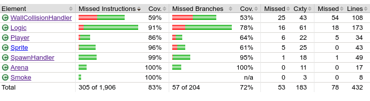

# Testausdokumentti

Ohjelmaa on testattu JUnitilla sekä manuaalisesti.

## Yksikkö- ja integraatiotestaus

### Sovelluslogiikka

JUnit testit testaavat jokaista luokkaa.
Integraatiotestausta esiintyy Logic-luokassa jonkin verran.

### Testauskattavuus

Testauskattavuus on hyvä, lukuunottamatta WallCollisionHandler -luokkaa sekä muutamaa satunnaista tapahtumaa.
WallCollisionHandler-luokassa ei testata tapauksia, joissa pelaaja on seinän sisässä kulmista sekä vain keskiosasta.

## Järjestelmätestaus

Sovelluksen järjestelmätestaus on suoritettu manuaalisesti.

### Asennus ja konfigurointi

Sovellus on haettu ja sitä on testattu [käyttöohjeen](kayttoohje.md) kuvaamalla tavalla Linux-ympäristössä siten, että sovelluksen käynnistyshakemistossa on ollut sovelluksen vaatimat kansiot ja tiedostot.

Sovellusta on myös testattu Windows-ympäristössä, jossa ilmeni, että pelin ikkuna ei ole Windows-ympäristössä oikean kokoinen.

### Toiminnallisuudet

Kaikki toiminnallisuudet on käyty läpi ja niistä on yritetty etsiä virheitä.
Yksi virhe on sellainen, että välillä aseella 'Lightsaber' pystyy vahingoittamaan itseään, vaikkei sen pitäisi olla mahdollista.

## Sovellukseen jääneet laatuongelmat

Sovellus ei anna järkeviä virheilmoituksia jos jokin vaadittava kansio tai tiedosto puuttuu.