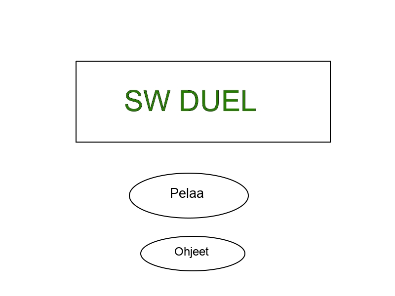
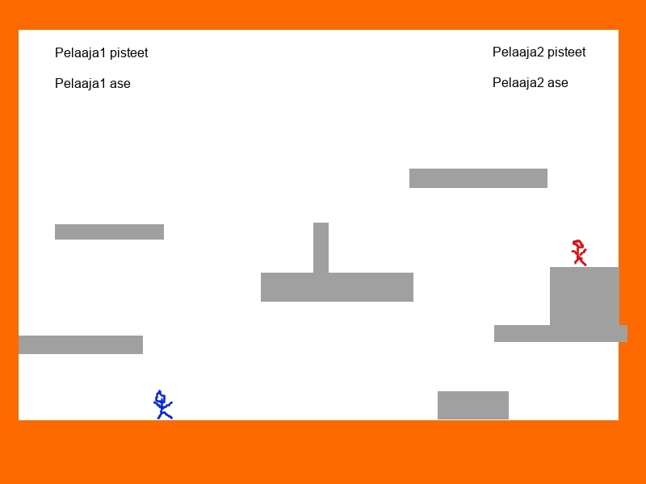

# Vaatimuusmäärittely

## Sovelluksen yleiskuvaus

- Sovellus on peli, jossa kaksi pelaajaa taistelevat toisiaan vastaan. Molemmat pelaajat kontrolloivat omaa hahmoaan ja yrittävät saada osumia toiseen pelaajaan.

## Käyttäjät

- Pelin pelaamiseen tarvitaan 2 henkilöä, jotka pelaavat samalta koneelta. Pelissä ei luoda omia käyttäjiä.

## Käyttöliittymä

- Käyttöliittymä on mahdollisimman yksinkertainen.
- Päävalikko voi siirtyä pelaamaan, vaihtaa areenaa tai kytkeä musiikin pois päältä.
- Pelissä voi taistella tai siitä voi poistua painamalla ESC:iä.

### Käyttöliittymäluonnos

## Pelin toiminnallisuus

- Sovellus käynnistyy päävalikkoon, josta voi valita areenan, kytkeä musiikin pois/päälle tai alkaa pelaamaan.
- Ohje kertoo lyhyesti pelin tavoitteen ja miten pelihahmoja liikutetaan.

### Pelaa

#### Areena

- Pelaajat taistelevat yhden pelin yhdellä areenalla. Areenalla on korkeuseroja ja tasoja, joilla pelihahmot voivat liikkua.

#### Taistelu

##### Ohjaaminen

- Peliä ohjataan näppäimistöltä
- Pelissä on tuki gamepadille. Jos padi on liitetty tietokoneeseen, ohjataan sillä toista pelaajaa näppäimistön sijasta.
- Jos tietokoneeseen on liitetty 2 gamepadia, ohjataan molempia pelaajia niillä.

##### Liikkuminen

- Pelihahmot pystyvät liikkumaan sivusuunnassa sekä lentämään rakettirepuilla.

##### Hyökkäys

- Pelihahmot voivat hyökätä aseellaan. Hyökkäys vaihtelee aseen mukaan.

##### Aseet

- Pelihahmot käyttävät erilaisia aseita, lähitaisteluaseista ampuma-aseisiin. Aseilla on erilaisia ominaisuuksia, kuten hyökkäysnopeus, ammuksen tyyppi ja hyökkäyksen kesto.

##### Ammukset

- Aseelle määritetään aina ammus. Ammuksia on erilaisia ja niillä on oma kokonsa ja grafiikkansa.

#### Kuolema

- Jos pelihahmo saa osuman, pelihahmo kuolee.
- Tällöin toinen pelaaja saa pisteen. Pisteen saaneen pelaajan ase vaihdetaan huonompaan. Osuman saanut pelaaja syntyy uudelleen samalla aseella.

#### Voittaminen
- Se pelaaja, joka ensimmäisenä on saanut pisteen jokaisella aseella parhaimmasta huonoimpaan, voittaa.

## Jatkokehitystä
- hyökkääminen 8 ilmansuuntaan
- areenoille vaaroja: passiiviset (piikit, laava jne.) sekä aktiiviset (ammukset jne.)
- vaarojen laukeaminen kun pelaaja astuu tiettyyn kohtaan
- taustan luominen areenalle (satunnainen - areenakohtainen?)
- aseen vaihtumisen sijasta vaihtuu pelihahmo (jolla on kyseinen ase)
- Pelihahmoista erilaisempia. Esim. koko voi olla eri.